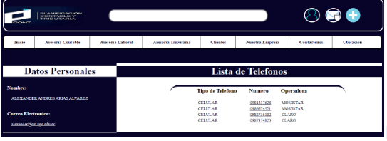
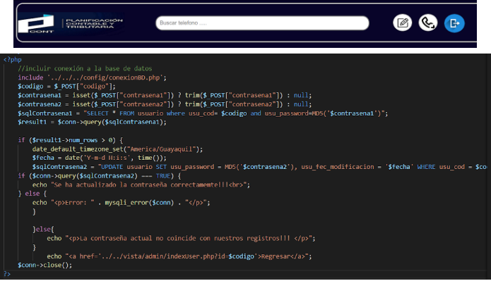

	TÍTULO PRÁCTICA: 
Resolución de problemas sobre PHP y MySQL

	OBJETIVO ALCANZADO:
•	Diseñar adecuadamente elementos gráficos en sitios web en Internet.

• Crear sitios web aplicando estándares actuales.

• Desarrollar aplicaciones web interactivas y amigables al usuario.

	ACTIVIDADES DESARROLLADAS
- Se pide desarrollar una aplicación PHP que permita implementar una agenda telefónica en
donde un usuario de la aplicación podrá gestionar su información y la misma estará
disponible para el público. Es decir, cada uno de estos usuarios podrá tener asignado uno 
o más teléfonos de contacto de diferente tipo y operador, por ejemplo:

  • El usuario “Juanito” tiene los teléfonos 0998121212 de tipo celular y operadora
  Movistar; así como también tiene asignado el teléfono 0728222111 de tipo
  convencional y operador CNT.
  Por lo cuál, con base al archivo PHP (Apuntes y ejercicios) se pide realizar los siguientes
  ajustes:
    • Agregar roles a la tabla usuario. Un usuario puede tener un rol de “admin” o
    “user”
    
   Para la asignación de los roles como usuario o admin, en la tabla de base de datos “agenda” se creó como se muestra en la imagen,       tomando en cuenta el camo usu_tipo para el tipo de usuario tanto “A” como administrador o “U” como usuario.
    
   </img>
    
   • Crear una tabla para almacenar los teléfonos de los usuarios:
    
   Para la creación de tabla teléfonos se tomo los siguientes campos: 
      Agregar código “tel_cod”
      Agregar tipo de teléfono como Celular o Convencional “tel_tipo”
      Agregar número de teléfono “tel_numero”
      Agregar operadora a la que pertenece como Movistar, Claro, entre otro “tel_operadora”
      El código de usuario a la que pertenece el número de teléfono “tel_usu_cod”
    
   </img>
    
   • Los usuarios “anónimos” pueden registrarse en la aplicación a través de un
    formulario de creación de cuentas.
      En la página index.html se encuentra la opción para que un usuario anónimo pueda crearse una cuenta.
      En esta página contiene parámetros que deben ingresarse como cédula, nombres, apellidos, etc.
      Cada parámetro tiene que ser validado para que se pueda agregar el usuario.

   </img>
    
   • Los usuarios “anónimos” listar los números de teléfono de un usuario usando su
    número de cédula o correo electrónico
      En la página index.html se encuentra un buscador para que el usuario anónimo pueda buscar un teléfono por el 
      numero de cedula o el correo.
      
   </img>
    
   Si los datos son correctos  nos mostrará la siguiente página en donde muestra los datos y los números del teléfono 
   del usuario que se busco, en caso de que el dato ingresado no sea el correcto se regresará a la página principal.
      
   </img>  
    
   • Los usuarios “anónimos” podrá llamar o enviar un correo electrónico desde el
    sistema usando aplicaciones externas.
    
   Cuando hacemos click en el correo de la persona, nos abrirá a una aplicación externa en donde podremos enviar un 
    mensaje a esa persona.
    
   </img> 
    
   Cuando hacemos click en alguno de los números de teléfono nos pedirá usar una aplicación externa en donde podremos 
    realizar la llamada al número seleccionado.
    
   </img> 
    
   • Un usuario puede iniciar sesión usando su correo y contraseña, y deoendiendo
    del rol podrá:
      En la página login.html se encuentra el diseño para que los usuario puedan acceder al sitio WEB, dependiendo 
      si son usuarios administradores ¨A¨ o solamente usuarios “U”
      
   </img> 
      
   a. Los usuarios con rol de “admin” pueden: agregar, modificar, eliminar,
      buscar, listar y cambiar la contraseña de cualquier usuario de la base de
      datos.
        Los usuario que tengan el rol de administrador, tendrá acceso a la página indexAdmin para realizar el agregar, modificar,
        eliminar, buscar, listar y cambiar la contraseña de los usuario que se encuentren registrados en la base de datos ¨agenda¨.
        Para la realización de todas las acciones que debe realizar el usuario administrador se encuentran en la parte de los botones y
        al lado derecho de la tabla, como se muestra en la siguiente imagen. 
        
   </img> 
        
   Para eliminar un usuario desde el administrador, se toma como referencia el código del usuario ¨usu_cod¨, dentro de la base de
        datos en el campo ¨usu_eliminado¨ se guarda una S, en caso de que el usuario se eliminó. Por otro lado también se guarda con la
        fecha de la última vez que se realizó una modificación.
        
   </img> 
        
   Para modificar un usuario desde el administrador, se toma como referencia el código del usuario ¨usu_cod¨, dentro de la base de
        datos se actualiza los datos que son modificados, en caso de no modificarse algo se guarda como tiene los datos anteriormente y
        con la última fecha de modificación, se implementó de la siguiente manera.
        
   </img>
        
   Para cambiar la contraseña, se pide la actual con la que se registro principalmente y la nueva contraseña que desea cambiar, en
        caso de que las contraseña actual no coincida con la registrada anteriormente se muestra un mensaje de error. Por último si el
        usuario digita la contraseña anterior podrá cambiar su contraseña y poner una actual.
        
   </img>
        
   </img>
        
   b. Los usuarios con rol de “user” pueden modificar, eliminar y cambiar la
      contraseña de su usuario.
        Los usuario que tengan el rol de usuario, tendrá acceso a la página indexUser para realizar las acciones anteriormente
        descritas. Como se muestra a continuación. 
      
   </img>
        
   c. Los usuarios con rol de “user” pueden agregar, modificar, eliminar,
      buscar y listar sus teléfonos.
        Para agregar teléfono el usuario deberá entrar a un formulario, en donde se solicita el tipo de teléfono, el número de teléfono
        y la operadora a la que pertenece el teléfono. Por lo tanto se implementó el siguiente código, se toma como referencia el código
        de usuario que se encuentra logueado en la página WEB.
        
   </img>
        
   Los usuarios loggeados pueden modificar y eliminar sus telefonos a travez de una tabla como se muestra a continuación.
      
   </img>
        
   • Los datos siempre deberán ser validados cuando se trabaje a través de
    formularios.
  
   </img>

   De igual manera, se pide manejar sesiones para que existe seguridad en el sistema de
    agenda telefónica. Por lo qué, debe existir una parte pública y una privada. Para lo cuál,
    se debe tener en cuenta:
    • Un usuario “anónimo”, es decir, un usuario que no ha iniciado sesión puede
    acceder únicamente a los archivos de la carpeta pública.
    • Un usuario con rol de “admin” puede acceder únicamente a los archivos de la
    carpeta admin → vista → admin; y admin → controladores → admin
    • Un usuario con rol de “user” puede acceder únicamente a los archivos de la
    carpeta admin → vista → user; y admin → controladores → user
    La parte pública (usuario anónimos) y privada (usuario registrado) ha sido descrita en los
    requisitos antes planteados. Se debe generar una página con la experiencia e interfaz de
    usuario apropiada, como la que se muestra a continuación:
    
   La carpeta con el nombre de public contiene los php y html de todos los usuarios anónimos que ingresan a la página web.
   La carpeta con el nombre de admin contiene los archivos de los usuarios que se logean ya sean administradores o usuarios normales.

   </img>
